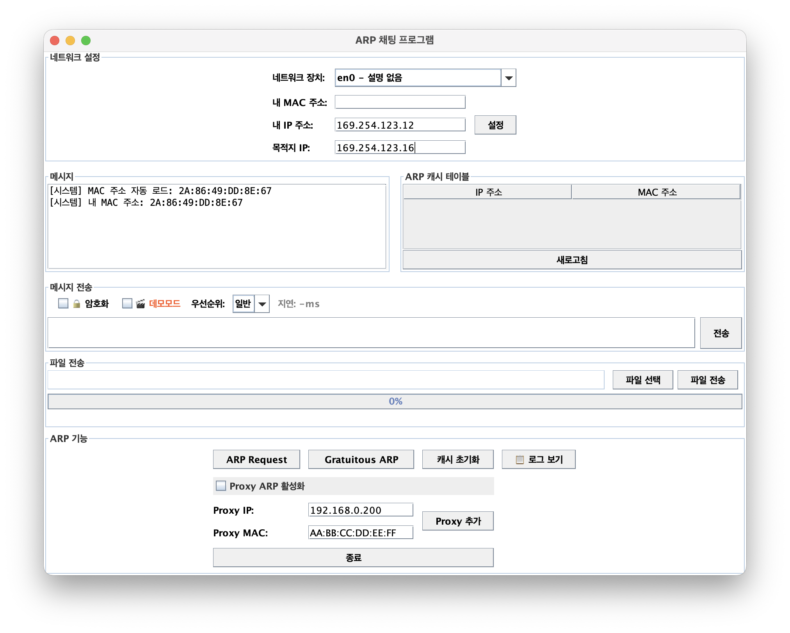

# 🖥️ NetworkChatApp 발표 자료 가이드

---

## 1️⃣ 프로젝트 개요 및 아키텍처

### 1.1 프로젝트 소개
- **목표**: jNetPcap 라이브러리를 활용하여 **L1(Physical)부터 L7(Application)까지의 네트워크 스택을 직접 구현**한 채팅 및 파일 전송 프로그램
- **특징**: TCP/UDP 없이 **Raw Ethernet/IP 패킷**을 직접 생성하여 통신


<center><i>[그림 1] 프로그램 실행 화면</i></center>

### 1.2 전체 아키텍처 (다중화 구조)
이 시스템의 핵심은 **"하나의 회선(IP)을 두 개의 앱(채팅, 파일)이 공유"**하는 것입니다.

```mermaid
[사용자 영역]
      │
      ├── (1) 채팅 (ChatAppLayer) ──┐
      │                             │ 다중화 (Multiplexing)
      └── (2) 파일 (FileAppLayer) ──┴─→ [IP Layer]
                                            │
                                        [Ethernet Layer]
                                            │
                                        [Physical Layer] ──→ Network
```

- **송신 시**: Chat과 File이 하나의 IP 계층으로 합쳐짐
- **수신 시**: IP 계층이 헤더를 보고 다시 Chat과 File로 분리 (역다중화)

---

## 2️⃣ 계층별 상세 역할 (Layer Structure)

OSI 7계층 모델을 기반으로 구현된 각 클래스의 역할입니다.


<center><i>[그림 2] 클래스 다이어그램</i></center>

| 계층 | 클래스명 | 핵심 역할 | 식별자(ID) |
|:---:|:---|:---|:---|
| **L7** | **ChatAppLayer** | 채팅 메시지 처리, 암호화, 단편화 | Protocol: `253` |
| **L7** | **FileAppLayer** | 파일 분할 전송 및 재조립 | Protocol: `254` |
| **L3** | **IPLayer** | IP 주소 관리, 라우팅, 패킷 우선순위 설정 | EtherType: `0x0800` |
| **L2** | **EthernetLayer** | MAC 주소 관리, 이더넷 프레임 생성 | - |
| **L2** | **ARPLayer** | IP 주소를 MAC 주소로 변환 (주소 해석) | EtherType: `0x0806` |
| **L1** | **PhysicalLayer** | NIC 하드웨어 제어, 실제 패킷 송수신 | - |

---

## 3️⃣ 핵심 동작 흐름 (Call Flow)

### 3.1 메시지 전송 흐름 (Encapsulation)
데이터가 내려가면서 **헤더(옷)를 하나씩 입는 과정**입니다.

1. **ChatAppLayer**: 사용자가 입력한 "안녕"을 바이트로 변환 + **[Chat 헤더]** 부착
2. **IPLayer**: 목적지 IP 확인 + **[IP 헤더]** 부착 (Protocol=253 기록)
3. **EthernetLayer**: 목적지 MAC 확인 + **[Ethernet 헤더]** 부착
4. **PhysicalLayer**: 랜선으로 전기 신호 전송

### 3.2 메시지 수신 흐름 (Decapsulation)
데이터가 올라오면서 **헤더를 하나씩 벗기고 분류하는 과정**입니다.

1. **EthernetLayer**: `EtherType` 확인
   - `0x0800`이면 **IPLayer**로 전달
   - `0x0806`이면 **ARPLayer**로 전달
2. **IPLayer**: `Protocol` 번호 확인
   - `253`이면 **ChatAppLayer**로 전달 (채팅)
   - `254`이면 **FileAppLayer**로 전달 (파일)
3. **ChatAppLayer**: 최종 메시지 복원 및 화면 표시

### 3.3 ARP 동작 (주소 알아내기)
상대방의 IP는 알지만 MAC 주소를 모를 때 수행합니다.

- **Request**: "192.168.0.10 누구니?" (방송/Broadcast)
- **Reply**: "나야, 내 MAC은 AA:BB:CC...야" (응답/Unicast)
- **Result**: 내 내부 **ARP 캐시 테이블**에 저장 후 통신 시작

---

## 4️⃣ ✨ 주요 구현 기능 (Key Features)

기본 통신 외에 성능과 보안을 위해 추가된 3가지 핵심 기능입니다.

### ① 🔒 보안: XOR 암호화 (Encryption)
- **목적**: 패킷 스니핑(도청) 방지
- **원리**: 송신 시 특정 키(`0x42`)와 XOR 연산하여 데이터를 난독화
- **동작**:
  - 송신: `Original` ^ `Key` = `Encrypted`
  - 수신: `Encrypted` ^ `Key` = `Original`
- **효과**: 네트워크 중간에서 패킷을 가로채도 내용을 알 수 없음

### ② ⚡ 성능: 우선순위 처리 (Priority Handling)
- **목적**: 긴급한 메시지를 일반 메시지보다 먼저 처리
- **구현 방법**:
  1. **L7 (Chat)**: `PriorityBlockingQueue`를 사용하여 수신된 메시지 정렬
  2. **L3 (IP)**: IP 헤더의 `TOS(Type of Service)` 필드에 우선순위 마킹
- **시나리오**: 대량의 일반 메시지가 쌓여 있어도, '긴급' 메시지가 도착하면 **새치기하여 즉시 처리**됨

### ③ ⏱️ 모니터링: 지연시간 측정 (Latency Check)
- **목적**: 네트워크 상태 모니터링
- **구현 방법**:
  - 송신 시: 패킷 헤더에 `보낸 시각(Timestamp)` 기록 (8바이트)
  - 수신 시: `현재 시각` - `보낸 시각` = **지연 시간(Latency)** 계산
- **활용**: 지연 시간이 길어지면 UI 색상을 변경(초록→주황→빨강)하여 사용자에게 알림

---

## 5️⃣ 결론 및 요약

1. **계층 구조 준수**: 각 계층이 독립적으로 동작하며 인터페이스로만 통신
2. **확장성**: Protocol 번호만 추가하면 다른 앱(예: 보이스톡)도 쉽게 추가 가능
3. **완성도**: 단순 전송을 넘어 **암호화, 우선순위, 모니터링**까지 갖춘 완성형 프로토콜 스택
